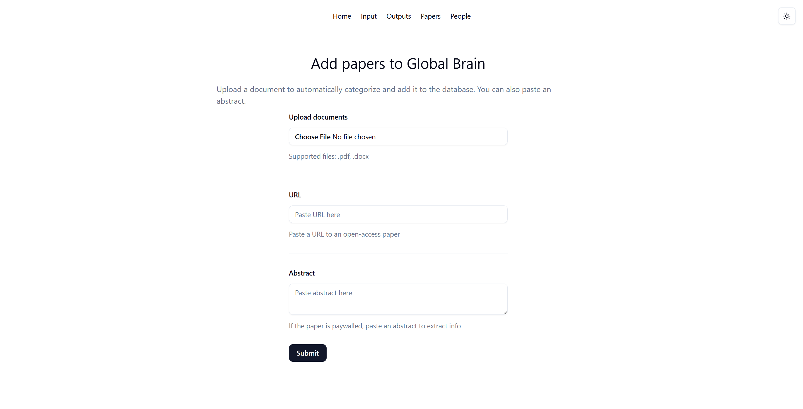
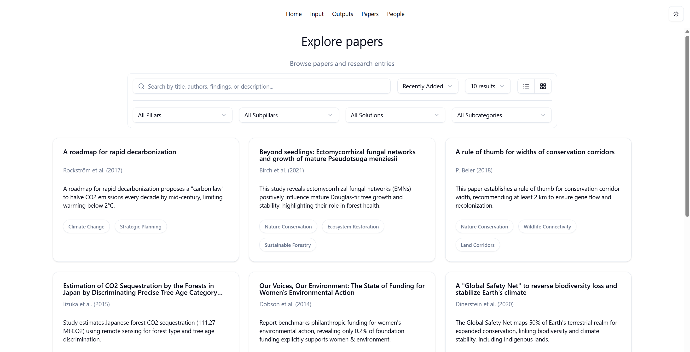

## Overview

Global Brain is a knowledge management system (KMS) for organizing metadata associated with scientific papers. It supports both document upload and open-access URLs. Using Google's Gemini API, the program generates metadata for each paper, allows users to manually edit the metadata, and finally stores it in a Supabase PostgreSQL database. The web application displays these papers in a separate tab. The web application uses the [shadcnui](https://ui.shadcn.com/) library on the frontend for a fluent, responsive user experience. It is currently in the development stage and has not yet been deployed on the cloud.

## Running

To run, clone the repository and run ```npm run dev``` at the project root. The project will launch by default at [https://localhost:3000](https://localhost:3000).

## Future work

Currently, work is underway to make the web app more mobile-friendly and add an authentication step.

## Gallery



